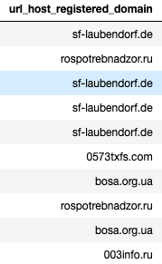
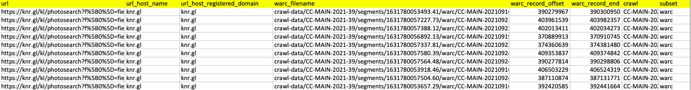

# aws_test

## **athena_lookup.py**: 
**Purpose**

This file takes a list of website addresses as its input and crawls the urls for the selected timeframe from common crawl. Then it outputs the address of subpages that contain specific keywords and the n shortest urls for each website address, where the specific keywords and n are determined by user.   

*Input example:* \

*Warning:* urls should not contain "https" or "www." upfront.

**Parameters**  
* n_subpages: number of shortest subpages that are selected for each website address in the output table. 
* url_keywords: list of keywords that if any of them exists in a url address, that url is selected in the output table. 
* crawl: this parameter determines the desired timeframe. Once the desired months for the analysis are determined, using [this website](https://skeptric.com/common-crawl-time-ranges/), one can find the common crawl time range for each month. By putting together these time ranges in the following format, this parameter is constructed: (... OR crawl = 'CC-MAIN-2020-24' OR crawl = 'CC-MAIN-2020-50')
 

**Code explanation**

The main function that is executed in the Athena_lookup class is the run_lookup(self) function. This function calls some other important functions. The description for the tasks of each function is as following: 
* drop_all_tables(self): This function drops tables if there exists any. 
* create_url_list_table(self): This function creates a new table from the input file, with columns "websiteaddress" and "bvdidnumber".
* create_ccindex_table(self): This function creates a large table by selecting some columns from the original common crawl database.
* repair_ccindex_table(self): ?
* inner_join(self): This function merges the two tables created through create_ccindex_table(self) and create_url_list_table(self) functions. The resulting table contains the address of all the historical subpages of the urls in the input file, for the selected timeframe.   
* select_subpages(self): The merged table created through the inner_join(self) function is very large. Therefore, we only select the subpages that contain a specific keyword in their website address, and the n_subpages shortest urls. n_subpages is an integer number and is one of the parameters that is determined by the user. 

*Output example:*\

